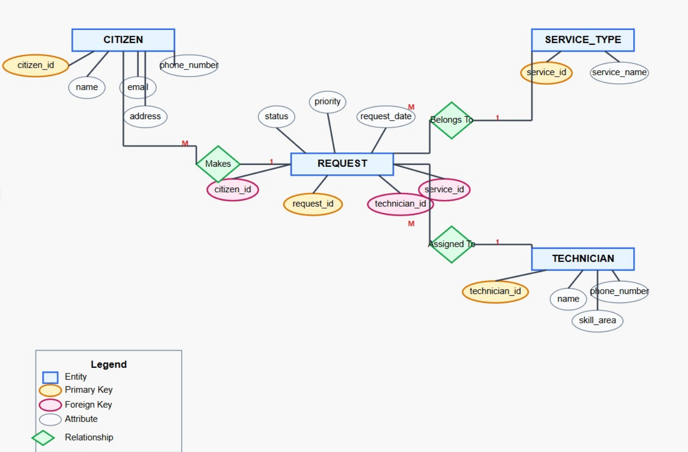
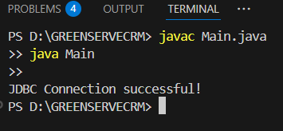

# GREENSERVECRM
# GreenServe CRM – Service Request & Sustainability Tracker

## 1. Project Overview
GreenServe CRM is a console-based Java application for managing citizen service requests related to sustainability, such as:
- Solar panel installation
- Waste management
- Pollution control

It supports:
- Citizen registration and request submission
- Admin-side tracking, assignment, and monitoring
- Request prioritization using queues

---

## 2. Technologies Used
- Java (OOP concepts, Enums, Collections)
- MySQL (Relational database)
- JDBC (Java Database Connectivity)
- Java Time API (for date handling)

---

## 3. Database Schema
Tables used:
- `citizen(citizen_id, name, email, phone, address)`
- `technician(technician_id, tech_name, phone, skill_area)`
- `service_type(service_id, service_name)`
- `request(request_id, citizen_id, technician_id, service_id, status, priority, request_date)`

All tables are interlinked using foreign keys to maintain referential integrity.

### ERD Diagram

---

## 4. Features Implemented

### Java Classes:
- `Citizen`, `Request`, `ServiceType` – model classes
- `Status`, `Priority` – enums for request status and priority
- `DBUtil`, `CitizenDAO`, `RequestDAO` – database interaction classes

### Functionalities:
- CRUD operations for `Citizen` and `Request`
- JDBC-based MySQL integration
- Exception handling for database and input operations
- Request filtering: only `PENDING` requests are prioritized
- Priority queue implemented using `PriorityQueue`

---

## 5. How to Run

### Prerequisites:
- MySQL installed and configured
- Java installed

### Steps:
1. Clone or Download
2. Run the `schema.sql` file in MySQL Workbench to create the database and tables.
3. Update the database credentials in `DBUtil.java`.
4. To verify that your connection works before      running the full app,In Main.java, temporarily add this code:
```java
try {
    Connection con = DBUtil.getConnection();
    if (con != null && !con.isClosed()) {
        System.out.println("JDBC Connection successful!");
    } else {
        System.out.println("Connection failed.");
    }
    con.close();
} catch (Exception e) {
    e.printStackTrace();
}
```

5. Compile and run the application using:
```bash
   javac Main.java
   java Main
```
6. 
